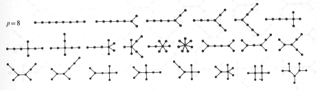

```{css echo=FALSE}
.caption {
  margin: auto;
  text-align: center;
}
```

```{r, include = FALSE}
knitr::opts_chunk$set(
  collapse = TRUE,
  comment = "#>"
)
```

```{r setup, echo = FALSE, warning=FALSE}
library(magrittr)
library(stringr)
library(spantreeorbits)
source("./rgl_setup.R")
rgl::setupKnitr(autoprint = TRUE)
```

The goal of **_spantreeorbits_** is to use algebra to generate the orbits of the spanning trees of some polyhedra.

## Installation

You can install the development version of spantreeorbits like so:

``` r
install.packages("devtools")
devtools::install_github("JeffLansing/spantreeorbits")
```

## Example

Consider the tetrahedron, a self-dual polyhedron with 4 vertices, 4 faces, and 6 edges. (See: <https://dmccooey.com/polyhedra/Tetrahedron.html>)

We will use some external tools to assemble some facts about this polyhedron. These are [Sage](https://www.sagemath.org/) and [GAP](https://www.gap-system.org/), which will be accessed in the following using [Sage Cells](https://sagecell.sagemath.org/). To run the code shown in any Sage Cell, click the *Evaluate* button below the cell.


```{=html}
<div>
<script src="https://sagecell.sagemath.org/static/embedded_sagecell.js" data-external="1"></script>
<script>sagecell.makeSagecell({"inputLocation": ".sage"});</script>
<link rel="stylesheet" type="text/css" href="https://sagecell.sagemath.org/static/sagecell_embed.css"  data-external="1">
<div class="sage">
  <script type="text/x-sage">
tet = graphs.TetrahedralGraph()
tet.relabel({0:1,1:2,2:3,3:4})
st = tet.spanning_trees()
for i,t in enumerate(st):
    print(t.edges(labels=False))
  </script>
</div>
</div>
```


Each of these 16 spanning trees of the (skeleton graph of) the tetrahedron has 3 edges, which connect all 4 vertices, without cycles. We can look at the kinds of trees on 4 vertices as follows.

```{=html}
<div>
<script src="https://sagecell.sagemath.org/static/embedded_sagecell.js" data-external="1"></script>
<script>sagecell.makeSagecell({"inputLocation": ".sage"});</script>
<link rel="stylesheet" type="text/css" href="https://sagecell.sagemath.org/static/sagecell_embed.css"  data-external="1">
<div class="sage">
  <script type="text/x-sage">
t4 = graphs.trees(4)
for i,t in enumerate(t4):
    t.relabel({0:1,1:2,2:3,3:4})
    print(t.edges(labels=False))
  </script>
</div>
</div>
```

So there are two different kinds of trees on 4 vertices. Each of the 16 different spanning trees for the tetrahedron will be one of these two kinds. The goal in this example is to find a group that acts on the set of spanning trees of the tetrahedron and produces exactly 2 orbits, each of which contains all and only trees of one kind.

According to [this document](https://doi.org/10.1016/j.tcs.2024.114593), in Table 1, there are exactly two nets of the tetrahedron. So later we might look at the connections between the two orbits, the two kinds of trees, and the two nets. This will be in a separate vignette.

Each spanning tree of the tetrahedron has 3 edges, and the tetrahedron is self dual, so we will look for some more facts about these two sets of 3 edges (one set for the spanning trees of the tetrahedron, and the other for the spanning trees of its dual). We will use GAP for this.

```{=html}
<div>
<script src="https://sagecell.sagemath.org/static/embedded_sagecell.js" data-external="1"></script>
<div id="cell2">
<script type="text/x-sage">
s6 := SymmetricGroup(6);
ll6 := LowLayerSubgroups(s6,2);;Display(List(ll6, Order));
Print(StructureDescription(ll6[21]), ", ", StructureDescription(ll6[22]), "\n");
rc21 := RightTransversal(s6, ll6[21]);;
lrc := List(rc21, x -> ListPerm(x,6));;
for p in lrc do Print(p,"\n");; od;;
</script>
</div>
<script>
sagecell.makeSagecell({
inputLocation: '#cell2',
languages: ['gap'],
//Focus the editor
callback: function() {$('#cell2').find(".CodeMirror").get(0).CodeMirror.focus();}
});
</script>
</div>
```

When we evaluate this GAP code, we see that the symmetric group $ S_6 $ has 2 subgroups of order 36, called $ S_3 $ x $ S_3 $. Further, looking at the representatives of the right cosets in $ S_6 $ of either of these subgroups (shown here for the second one as a table with 20 rows), we see how to relate these cosets to the 2 sets of 3 edges mentioned above. We use the R code in this package to explain the relation. 

First we have to label the edges in the two sets in a canonical way. A figure will help to explain this.

```{r get_tet_maps, echo=FALSE}
data(tetrahedron, package = "spantreeorbits")
data(dual_tetrahedron, package = "spantreeorbits")
data(rhombic_dodecahedron, package = "spantreeorbits")
data(c2xs4_oct, package = "spantreeorbits")

# These are representatives of the right cosets of S3xS3 in S6
reps <- rbind(
    c(1, 2, 3, 4, 5, 6),
  c(1, 2, 4, 3, 5, 6),
  c(1, 2, 5, 3, 4, 6),
  c(1, 2, 6, 3, 4, 5),
  c(1, 3, 4, 2, 5, 6),
  c(1, 3, 5, 2, 4, 6),
  c(1, 3, 6, 2, 4, 5),
  c(1, 4, 5, 2, 3, 6),
  c(1, 4, 6, 2, 3, 5),
  c(1, 5, 6, 2, 3, 4),
  c(2, 3, 4, 1, 5, 6),
  c(2, 3, 5, 1, 4, 6),
  c(2, 3, 6, 1, 4, 5),
  c(2, 4, 5, 1, 3, 6),
  c(2, 4, 6, 1, 3, 5),
  c(2, 5, 6, 1, 3, 4),
  c(3, 4, 5, 1, 2, 6),
  c(3, 4, 6, 1, 2, 5),
  c(3, 5, 6, 1, 2, 4),
  c(4, 5, 6, 1, 2, 3)
)
```

```{r}
trees <- trees_from_perms(rhombic_dodecahedron, reps, 3, 3)
orbits <- get_orbits_of_trees(trees, c2xs4_oct$elements, 3, 3)
```

```{r echo=FALSE}
knitr::kable(t(orbits[[1]]), caption = "orbit 1")%>% kableExtra::kable_styling(full_width = F, position = "left")
knitr::kable(
  trees[orbits[[1]],] %>% `rownames<-`(orbits[[1]]),
  caption = "12 of 16 trees in orbit 1",
  format = "html",
  escape = FALSE,
  align = 'c',
  col.names = NULL) %>% kableExtra::kable_styling(
  full_width = F, position = "left") %>% 
  kableExtra::column_spec(c(1:7), width = "1.1em") %>% 
  kableExtra::column_spec(c(4,7), border_right = T) %>% 
  kableExtra::column_spec(c(2), border_left = T)
```

```{r echo=FALSE}
knitr::kable(t(orbits[[2]]), caption = "orbit 2")%>% kableExtra::kable_styling(full_width = F, position = "left")
knitr::kable(
  trees[orbits[[2]],] %>% `rownames<-`(orbits[[2]]),
  caption = "4 of 16 trees in orbit 2",
  format = "html",
  escape = FALSE,
  align = 'c',
  col.names = NULL) %>% kableExtra::kable_styling(
  full_width = F, position = "left") %>% 
  kableExtra::column_spec(c(1:7), width = "1.1em") %>% 
  kableExtra::column_spec(c(4,7), border_right = T) %>% 
  kableExtra::column_spec(c(2), border_left = T)

```
   And now the figure, which has 3 parts:

```{r display1a, fig.align='center', fig.cap=c("Figure 1a. A tetrahedron and its dual, with some spanning trees, as red edges.")}
display_tree_pairs(tetrahedron, dual_tetrahedron, rhombic_dodecahedron, trees, orbits[[2]])

```

In Figure 1a we see that the *get_orbits_of_trees* function has separated the spanning trees into kinds: 1a has all of the *claw* (or $ K_{1,3} $) graphs.^[This terminology is from https://www.graphclasses.org/smallgraphs.html#nodes4.] 
There are 4 such spanning trees, corresponding to the 4 vertices of the tetrahedron.

The edges in the figure are labeled by their row index in the (appropriate half of) the neighbor map (*rhombic_dodecahedron$nghmap*), which also correspond to the points in the appropriate permutation word, in the matrix of trees.


```{r display1b, fig.align='center', fig.cap=c("Figure 1b.i. A tetrahedron and its dual, with some spanning trees, as red edges.")}
display_tree_pairs(tetrahedron, dual_tetrahedron, rhombic_dodecahedron, trees, orbits[[1]][c(1,12,2,11,3,10)])

```

```{r display1c, fig.align='center', fig.cap=c("Figure 1b.ii. A tetrahedron and its dual, with some spanning trees, as red edges.")}
display_tree_pairs(tetrahedron, dual_tetrahedron, rhombic_dodecahedron, trees, orbits[[1]][c(4,9,5,8,6,7)])
```

Figures 1b.i and 1b.ii contain all of the spanning trees which are *path* (or $ P_4 $) graphs.

The left and right parts of Figures 1b.i and 1b.ii are the same, except that the tetrahedra and the duals are switched. There are 6 such pairs of spanning trees, corresponding to the $ _4C_2 = 6 $ ways that the 2 ends of a *path* tree can be mapped to the 4 vertices of the tetrahedron.

## Another Example

We consider the cube,  with 8 vertices, 6 faces, and 12 edges, and its dual polyhedron, the octahedron. A spanning tree for the cube will touch the 8 vertices once, so will have 7 edges^[
**Proof**: Every node except the root has exactly one in-coming edge. Since there are $ n-1 $ nodes other than the root, there are $ n-1 $ edges in a tree.]; similarly, a spanning tree for the octahedron will have 5 edges. Since $ 7 + 5 = 12 $, the appropriate data source for this example will be $ S_{12} $, but since the order of $ S_{12} $ is $ 479001600 $ -- too large for a vignette example -- we will restrict it by using the cosets of $ S_7 \\times S_5 $ in $ S_{12} $, so we will have a data source of size $ 479001600 / (5040 * 120) = 792 $, which is the *s7s5cosetreps.rda* data set in this package.

```{r echo=FALSE}
data(cube, package = "spantreeorbits")
data(octahedron, package = "spantreeorbits")
data(deltoidal_icositetrahedron, package = "spantreeorbits")
# This is a temporary fix. I should go away when the polyhedra are better aligned.
# cube$verts <- deltoidal_icositetrahedron$verts[19:26,]
# octahedron$verts <- deltoidal_icositetrahedron$verts[1:6,]
#fixed 4/13/2025

```


```{r}
trees <- trees_from_perms(deltoidal_icositetrahedron, s7s5cosetreps, 7, 5)
nrow(trees)
orbits <- get_orbits_of_trees(trees, c2xs4_co$elements, 7, 5)
length(orbits)

```

Using the association between vertices and edges of the cube and the octahedron (*deltoidal_icositetrahedron$nghmap*) we get 384 spanning trees in this case, and using the automorphism group of the cuboctahedron (see the [Automorphism Groups](Automorphism_Groups.html#alignment-of-the-cube-and-the-octahedron) vignette) we get 11 orbits.

If we look at, say, the first tree in each orbit, we see that this compares favorably with the [results of Peter Turney](https://unfolding.apperceptual.com/)^[Turney, Peter D. "Unfolding the tesseract." Journal of Recreational Mathematics 17.1 (1984): 1-16.], in that it agrees with him that for the octahedron there are 11 different nets, even though there are only 4 different tree graphs which span the octahedron.

```{r display2a, fig.align='center', fig.cap=c("Figure 2a. A cube and its dual, with some spanning trees, as red edges.")}
display_tree_pairs(cube, octahedron, deltoidal_icositetrahedron, trees, rbind(orbits[[1]][1],orbits[[2]][1],orbits[[5]][1],orbits[[8]][1]))
```

In Figure 2a we have the 4 pairs where the octahedron is spanned by the $ P_6 $ *path* graph.

```{r display2b, fig.align='center', fig.cap=c("Figure 2b. A cube and its dual, with some spanning trees, as red edges.")}
display_tree_pairs(cube, octahedron, deltoidal_icositetrahedron, trees, rbind(orbits[[3]][1],orbits[[4]][1],orbits[[10]][1]))
```

In Figure 2b we have the 3 pairs where the octahedron is spanned by the $ star_{1,1,3} $ graph.

```{r display2c, fig.align='center', fig.cap=c("Figure 2c. A cube and its dual, with some spanning trees, as red edges.")}
display_tree_pairs(cube, octahedron, deltoidal_icositetrahedron, trees, rbind(orbits[[6]][1],orbits[[7]][1],orbits[[9]][1],orbits[[11]][1]))
```

In Figure 2c we have on the top the 2 pairs where the octahedron is spanned by the $ star_{1,2,2} $ graph, and on the bottom the pair where the octahedron is spanned by the $ H_1 $ graph on the left, and the pair where the octahedron is spanned by the $ star_{1,1,1,2} $ graph on the right.

Since we are investigating here the matching spanning trees of the cube and of its dual, we should look at the tree graphs which span the cube. Here are the 23 tree graphs with 8 vertices:

<center>
{#id .class width=75% height=75%}
</center>
Note^[Available online at [StackExchange](https://math.stackexchange.com/questions/407562/gallery-of-unlabelled-trees-with-n-vertices), perhaps taken from: *Graph Theory*. By FRANK HARARY. Addison-Wesley, Reading, Mass., 1969. ix + 274 pp.]

Of these 23 trees, only 5 will span a cube: the first, third, and fourth trees in the first row of the figure, the seventh tree in the second row, and the first 2 trees in the third row of the figure. Following the [ISGCI nomenclature](https://www.graphclasses.org/smallgraphs.html#nodes8) these 5 trees are named, in order,

\[
\begin{array}{lllll}
P_8, & star_{1,2,4}, & star_{2,2,3}, & H_3, & _{1,1}^{2,2}H_1, & \text{and } _{1,1}^{1,3}H_1 \\
\end{array}
\]
Note^[The distinction of different H-graphs is inspired by Johnson, Matthew, et al. "Complexity framework for forbidden subgraphs I: The framework." Algorithmica (2025): 1-36. Their Figure 1, p.3 shows $ H_1 \text{and} h_3 $.]

Reviewing briefly, the hypothesis is that the 384 spanning trees of the cube and the 384 spanning trees of the octahedron are "associated", and we have associated them here by concatenation, in the way that $ S_7\\times S_5 $ does. So the *trees* that we are looking at here are elements of $ S_{12} $. The orbits that we are looking at here are created by applying the cuboctahedral group, created in the [Automorphism Groups](./Automorphism_Groups.html#alignment-of-the-rhonbic-dodecahedron-and-the-cuboctahedron) vignette, to the 12 vertex spanning trees. 

```{r}
lapply(orbits, length) %>% unlist() #lengths
lapply(orbits, function(v) v[1]) %>% unlist() #representatives
```
Within each orbit, the 24 or 48 elements are structurally indistinguishable (they all have the same spectrum). But if we take the elements apart, as in Figure 2 above, we start to see distinctions. Looking at the first element of each orbit as a representative, we see that the tree graph for the left part of the representative, together with the tree graph for the right part, distinguishes (with one exception) the 11 orbits. And if we go on to look at both the tree graphs and their complements (shown in green in Figure 2), then in fact the orbits are completely characterized by 4 small graphs, as shown in the table below.
\[
\begin{array}{|c|c|c|c|c|}
  n & \text{cube} & \text{co-cube} & \text{oct} & \text{co-oct} \\
  \hline
  1 & P_8 & P_2\cup 2P_3 & P_6 & \textit{twin-}C_5 \\
  \hline
  2 & star_{1,2,4} & P_3\cup P_4\cup K_1 & P_6 & X_{37} \\
  \hline 
  6 & H_3 & P_6\cup 2K_1 & P_6 & 2K_3+e \\
  \hline
  9 & P_8 & 2P_2\cup P_4 & P_6 & \textit{twin-}C_5 \\
  \hline 
  3 & star_{1,2,4} & P_3\cup P_4\cup K_1 & star_{1,1,3} & \overline{X_5} \\
  \hline
  5 & _{1,3}^{1,1}H_1 & P_6\cup 2K_1 & star_{1,1,3} & X_{171} \\
  \hline
  11 & P_8 & P_4\cup 2P_2 & star_{1,1,3} & X_{45} \\
  \hline 
  7 & star_{2,2,3} & P_5\cup P_2\cup K_1 & star_{1,2,2} & antenna \\
  \hline 
  8 & star_{1,2,4} & P_5\cup P_2\cup K_1 & star_{1,2,2} & \overline{X_5} \\
  \hline
  18 & ^{1,1}_{2,2}H_1 & P_6\cup 2K_1 & H_1 & \textit{co-twin-house} \\
  \hline
  13 & ^{1,1}_{2,2}H_1 & C_4\cup K_2\cup 2K_1 & star_{1,1,1,2} & X_{170}\textit{-e}\cup K_1 \\
  \hline
\end{array}
\]

We can see some of these small graphs at ISGCI, for example [antenna](https://www.graphclasses.org/smallgraphs.html#antenna) or [co-twin-house](https://www.graphclasses.org/smallgraphs.html#twin-house). Here we look at a few of them geometrically in Figure 4 below.

```{r display4a, fig.align='center', fig.cap=c("Figure 4. A cube and its dual, with some small graphs.")}
display_tree_pairs(cube, octahedron, deltoidal_icositetrahedron, trees, c(5,6,18,13), split = TRUE)
```

## Towards A Third Example

We consider the rhombic dodecahedron,  with 14 vertices, 12 faces, and 24 edges, and its dual polyhedron, the cuboctahedron. A spanning tree for the rhombic dodecahedron will touch the 14 vertices once, so will have 13 edges; similarly, a spanning tree for the cuboctahedron will have 11 edges. Since $ 13 + 11 = 24 $, the appropriate data source for this example will be $ S_{24} $, but since the order of $ S_{12} $ is $ 620448401733239439360000 $ we will restrict it by using the cosets of $ S_13 \\times S_11 $ in $ S_{24} $, so we will have a data source of size $ 620448401733239439360000 / (6227020800 * 39916800) = 2496144 $, which is the *s13s11cosetreps.rda* data set in this package.

```{r echo=FALSE}
data(rhombic_dodecahedron, package = "spantreeorbits")
data(cuboctahedron, package = "spantreeorbits")
data("deltoidal_tetracontaoctahedron" , package = "spantreeorbits")
```

Furthermore, the following bit of code takes far too long, for a vignette, so the result was computed offline and is available as the *s13s11trees.rda* data set in this package. 

```{r eval=FALSE}
s13s1trees <- trees_from_perms(deltoidal_tetracontaoctahedron, s13s11cosetreps, 13, 11)
```

### Vectors over GF(2) and the Neighbor Map

```{r}
# Load the 331776 spanning tree pairs for the rhombic dodecahedron
# and its dual, the cuboctahedron
data(s13s11trees, package = "spantreeorbits")

#Look at one of the pairs, e.g., the twenty-first one
tree <- s13s11trees[21,]

tree %>% `dim<-`(c(1,24)) %>% kableExtra::kbl(caption = "The first of the spanning tree pairs, as a vector of edge labels: ") %>% kableExtra::column_spec(c(1:24), width = "2em") %>% 
  kableExtra::row_spec(1, align = 'c') %>% 
  kableExtra::column_spec(c(1,14), border_left = T) %>% 
  kableExtra::column_spec(c(13,24), border_rig = T)

```
</p>

We show that this particular pair actually is a pair of spanning trees:

```{r fig.align='center', fig.cap="red: rhombic_dodecahedron, green: cuboctahedron"}

get_spanning_trees <- function(pair) {
  radixs <- nmdtco[pair[1:13],1:2] %>% t() %>% c()
  cuixs <- nmdtco[pair[14:24],3:4] %>% t() %>% c()
  
  rad <- list(verts = rhombic_dodecahedron$verts, 
                     texts = rhombic_dodecahedron$texts, 
                     segments = rhombic_dodecahedron$verts[radixs,])
  cu <- list(verts = cuboctahedron$verts, 
                    texts = cuboctahedron$texts, 
                    segments = cuboctahedron$verts[cuixs,])
  list(rad = rad, cu = cu)
}

nmdtco <- deltoidal_tetracontaoctahedron$nghmap

sptrs <- get_spanning_trees(tree)

display_poly(deltoidal_icositetrahedron, dual = sptrs$rad, codual = sptrs$cu,
             show_axes = F, show_segments = F, show_labels = F)
```
</p>
Next we apply this particular tree pair to the appropriate neighbor map.

As shown in the [Pair_Alignment](Pair_Alignment.html) vignette, a neighbor map is a representation of the way that a polyhedron and its dual are aligned, within the larger polyhedron that contains them, by the dual of that larger polyhedron. In this case, the larger polyhedron is the deltoidal icositetrahedron, and its dual is the rhombicuboctahedron.

We can see how this alignment works by zooming in on the deltoidal tetracontaoctahedron, whic contains both the deltoidal icositetrahedron and the rhombicuboctahedron:

```{r fig.align='center', fig.cap="f and v: rhombic dodecahedron vertices, o: cuboctahedron vertices, r: rhombicuboctahedron vertices", fig.width = 4, fig.height = 4}

display_poly(deltoidal_tetracontaoctahedron, zoom = 2/5)

```
</p>
We see that, e.g., $r_5$ aligns its neighbors $f_1$ and $v_1$ with its other neighbors $o_3$ and $o_4$, and $r_{21}$ aligns $f_6$ and $v_8$ with $o_{10}$ and $o_{12}$.
Both $5$ and $21$ are in the right hand part of the example tree pair, and both $o_3$ and $o_4$, and $o_{10}$ and $o_{12}$ are green edges in the spanning tree figure, previously shown.

So in general, applying a tree pair to a neighbor map means using the values in the tree pair to select rows in the map, with the left part of the tree pair selecting the left part of the map, and similarly for the right parts. We show an example of this next.

```{r}

# Make the neighbor map easier to read
ttco <- cbind(
  str_c('f',nmdtco[,1]),
  str_c('v',nmdtco[,2] - 6),
  str_c('o',nmdtco[,3]),
  str_c('o',nmdtco[,4])
)

# A helper function for colors:
get_colors <- function(rw) {
  colors <- rep('gray50',24)
  colors[rw] <- 'white'
  colors
}

# Show the table:
ttco %>%`rownames<-`(str_c('r', 1:24)) %>% kableExtra::kbl() %>% 
  kableExtra::kable_styling(full_width = F, position = "center") %>% 
  kableExtra::column_spec(c(1:4), width = "2em") %>%
  kableExtra::add_header_above(c(" " = 1, "0" = 2, "1" = 2)) %>%
  kableExtra::row_spec(1:24, align = 'c') %>%
  kableExtra::column_spec(1, bold = T) %>% 
  kableExtra::column_spec(2:3, background = get_colors(tree[1:13])) %>%
  kableExtra::column_spec(4:5, background = get_colors(tree[14:24]))

```

</p>
The entries in the neighbor map that are not grayed out can be identified by listing which column (0 or 1) that they are in, in the map. 
This then gives a representation of the tree pair as a vector of zeros and ones.

```{r}

get_01vec <- function(tree) {
  rw <- tree[1:13]
  v <- rep(1,24)
  v[rw] <- 0
  v
}

vec <- get_01vec(tree)

vec %>% `dim<-`(c(1,24)) %>% kableExtra::kbl(caption = "The first of the spanning tree pairs, as a vector over GL(2): ") %>% kableExtra::column_spec(c(1:24), width = "1.2em") %>%
  kableExtra::row_spec(1, align = 'c') 

```
</p>
Since there are only 24 entries in this vector, it can be "naturally" encoded as a single integer, as follows.

```{r}

powers_of_two <- sapply(0:23, function(n) 2^n)

vec_to_int <- function(tree) {
  powers_of_two[which(vec == 1)] %>% sum()
}

int <- vec_to_int(vec)

# Just for fun, also show the factors:
factors <- gmp::factorize(int) %>% table() %>% str_c(names(.),'^{',., '}', collapse = ' ')
rep <- str_c(int, ' = ', factors)
```
</p>
So in this representation, the example tree pair becomes the integer: $$ `r rep ` $$

Clearly there will be $ 2^{24} $ such integers, and if we check with GAP we that the module $ GF(2)^{24} $ is exactly that size.

```{=html}
<div>
<script src="https://sagecell.sagemath.org/static/embedded_sagecell.js" data-external="1"></script>
<div id="cell4">
<script type="text/x-sage">
vs := GF(2)^24;
IsFreeLeftModule(vs);
2^24 = Size(vs);
</script>
</div>
<script>
sagecell.makeSagecell({
inputLocation: '#cell4',
languages: ['gap'],
//Focus the editor
callback: function() {$('#cell4').find(".CodeMirror").get(0).CodeMirror.focus();}
});
</script>
</div>
```
</p>
Summarizing, we have shown 5 different representations of a spanning tree pair: 

1. A 2-part vector of indices of vertices in a particular polyhedron

2. A "3d" *rgl* view of the tree pair

3. A shaded neighbor map

4. A vector of elements of $ GL(2) $

5. An integer between $ 0 $  and $ 2^{n} $, exclusive, where $ n $ is the length of the vector in representation 1.

The 331776 spanning tree pairs for the rhombic dodecahedron and the  cuboctahedron use slightly less than 2 percent of these representations.

### Arranging the Spanning Trees into Orbits
## Notes
